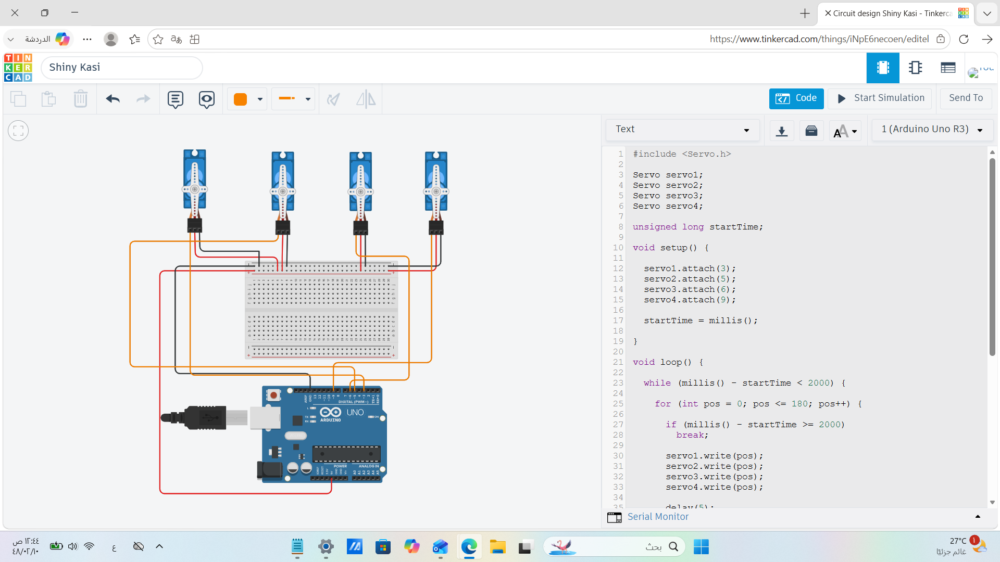
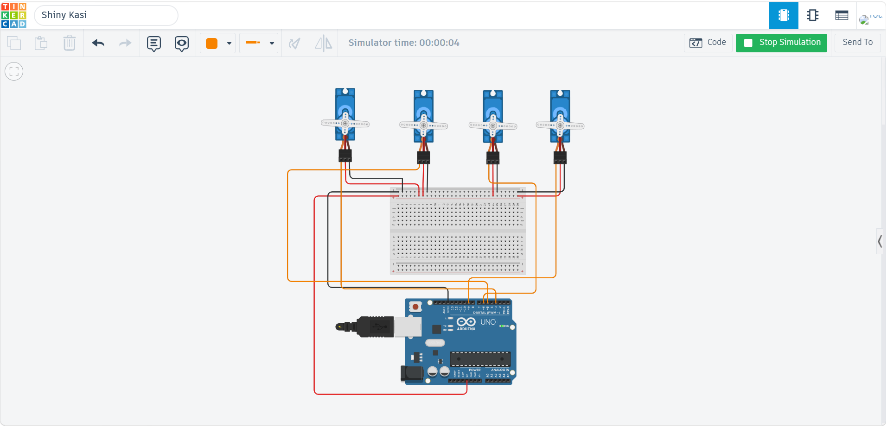

# Four-Servo-Motors-Sweep-Control-Using-Arduino

## 📌 Project Overview

This project controls four micro servo motors using an Arduino Uno. The motors perform the Sweep motion simultaneously for 2 seconds, then stop and hold at a fixed position of 90°.

## 🎯 Project Requirements

- Control four servo motors.
- Perform the Sweep movement.
- Run the movement for 2 seconds.
- Stop all servos at 90°.

## 🛠 Components Used

- Arduino Uno
- Breadboard
- 4 × Micro Servo Motors
- Jumper Wires

## 🔌 Circuit Connections

| Servo | Signal Pin |
|--------|------------|
| Servo 1 | D3 |
| Servo 2 | D5 |
| Servo 3 | D6 |
| Servo 4 | D9 |

Power connections:

- Arduino 5V → Breadboard (+)
- Arduino GND → Breadboard (-)
- All servo VCC → Breadboard (+)
- All servo GND → Breadboard (-)

## 📷 Circuit Diagram

## ✅ Final Position

All four servo motors stop and hold at 90° after completing the required Sweep movement.

## 🎥 Simulation Demo

Watch the project demonstration here:

**Simulation_Demo.mp4**

## 💻 Arduino Code

The complete Arduino source code is included in:

`Four_Servo_Motors_Control.ino`
